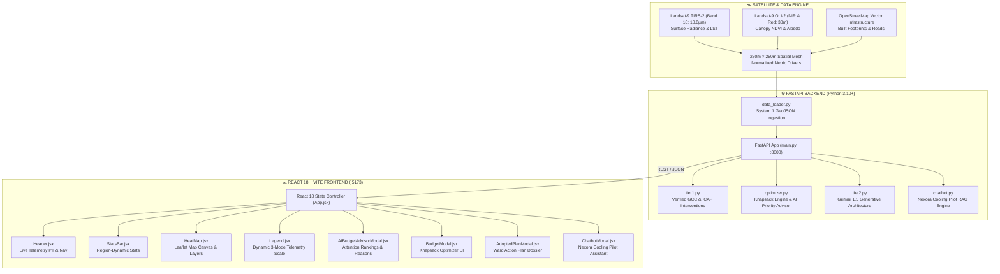
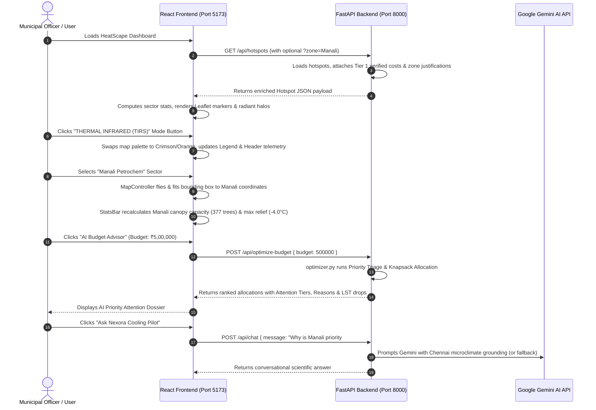

# HeatScape (Nexora) — Technical Architecture & System Specification

> **Platform**: HeatScape (Nexora CMA Platform v3.4-PROD)  
> **Domain**: Satellite Telemetry, Urban Heat Island (UHI) Diagnostics & AI Municipal Climate Finance  
> **Target Region**: Chennai Metropolitan Area (CMA), Tamil Nadu, India  
> **Repository**: [https://github.com/nivash-19/nexora](https://github.com/nivash-19/nexora)  
> **Live Web App**: [http://localhost:5173](http://localhost:5173) | **API Swagger**: [http://localhost:8000/docs](http://localhost:8000/docs)

---

## 1. Executive System Overview

HeatScape bridges the gap between **raw orbital Earth observation (satellite telemetry)** and **actionable municipal capital expenditure (budget optimization)**. The platform ingests Landsat-9 thermal and optical data across Chennai, analyzes microclimatic heat drivers per 1-hectare urban cell, maps research-backed Tier 1 interventions, generates generative AI cooling designs (Gemini), and runs mathematical knapsack budget optimization to maximize Land Surface Temperature (LST) reduction per rupee spent.



---

## 2. Full Technology Stack Breakdown

### Frontend Tech Stack
| Technology / Package | Version | Purpose & Implementation |
| :--- | :--- | :--- |
| **React** | `18.2.0` | Core reactive UI engine, managing state for hotspots, active telemetry layers, budget allocations, and persisted adopted action plans. |
| **Vite** | `5.4.21` | Next-generation frontend build tooling offering sub-second Hot Module Replacement (HMR) and optimized production Rollup bundling. |
| **Leaflet** | `1.9.4` | High-performance interactive cartographic engine rendering Chennai base maps, thermal overlays, and clickable hotspots. |
| **React-Leaflet** | `4.2.1` | React abstraction layer binding Leaflet lifecycle hooks to React state (`MapContainer`, `TileLayer`, `CircleMarker`, `Tooltip`, `useMap`). |
| **Axios** | `1.6.8` | Promise-based HTTP client communicating with the FastAPI backend across all endpoints with automated error retry fallbacks. |
| **Lucide-React** | `0.344.0` | Modern, clean iconography representing scientific sensors, thermal flames, trees, and navigation controls. |
| **Vanilla CSS Design System** | Modern CSS3 | Custom glassmorphism design system (`rgba` backdrops, `backdrop-filter: blur`, dynamic radial gradients, responsive CSS Grid/Flexbox). Zero heavy framework bloat. |

---

### Backend Tech Stack
| Technology / Package | Version | Purpose & Implementation |
| :--- | :--- | :--- |
| **FastAPI** | `0.110.0+` | High-performance, asynchronous ASGI web framework serving REST endpoints with auto-generated Swagger UI OpenAPI documentation. |
| **Python** | `3.10+ / 3.14` | Core backend programming language executing statistical calculations, knapsack optimization algorithms, and external API orchestration. |
| **Uvicorn** | `0.28.0+` | Lightning-fast ASGI server implementation running on `http://localhost:8000` with live reload triggers on code change. |
| **Pydantic** | `2.0.0+` | Strict schema validation and data parsing for incoming POST requests (e.g. `BudgetRequest`, `ChatRequest`). |
| **google-generativeai** | `0.8.0+` | Official Google GenAI SDK interfacing with Gemini 1.5 Pro / Flash models for creative Tier 2 cooling ideas and the conversational chatbot. |
| **python-dotenv** | `1.0.0+` | Secure loading of environment variables (e.g., `GEMINI_API_KEY`, server port) from local `.env` files. |
| **HTTPX** | `0.27.0+` | Next-generation asynchronous HTTP client for backend testing and external service health checks. |

---

### Remote Sensing & Spatial Data Pipeline
| Sensor / Metric | Spectrum / Resolution | Analytical Function |
| :--- | :--- | :--- |
| **Landsat-9 TIRS-2** | Band 10 ($10.8\,\mu\text{m}$), $100\text{m}$ resampled to $30\text{m}$ | Radiometric thermal infrared radiance converted to Land Surface Temperature (LST) using top-of-atmosphere brightness temperature and fractional vegetation emissivity. |
| **Landsat-9 OLI-2** | Band 5 NIR ($0.86\,\mu\text{m}$) & Band 4 Red ($0.65\,\mu\text{m}$), $30\text{m}$ | Normalized Difference Vegetation Index: $\text{NDVI} = \frac{\text{NIR} - \text{Red}}{\text{NIR} + \text{Red}}$. Quantifies chlorophyll health and vegetative canopy deficits. |
| **Normalized Drivers** | $250\text{m} \times 250\text{m}$ grid cells | Normalized metrics ($T_{norm}$ thermal anomaly, $V_{norm}$ canopy deficit, $I_{norm}$ impervious fraction, $W_{norm}$ distance to water body). |

---

## 3. How Everything is Linked (Data & Execution Flow)

The platform operates through a 5-stage synchronous and asynchronous data loop:



---

## 4. Backend Engine: What Every File & Endpoint Does

The backend lives in `system2-app/backend` and exposes clean REST endpoints:

### 1. `main.py` — ASGI Orchestrator & API Routes
- **CORS Middleware**: Allows cross-origin requests from `*` (enabling local development on `localhost:5173` as well as cloud deployment).
- **Endpoints Defined**:
  - `GET /`: Health status and service manifest.
  - `GET /api/health`: Diagnostic check reporting loaded hotspots count and System 1 data source status.
  - `GET /api/hotspots`: Returns all Chennai UHI hotspots enriched with Tier 1 recommendations, costs, and localized microclimatic justifications. Supports filtering via `?zone=Manali`.
  - `GET /api/grid/{grid_id}`: Returns single-cell inspection dossier for a specific grid ID (e.g. `cell_manali_001`).
  - `GET /api/tier2/{grid_id}`: Triggers Gemini 1.5 Pro to synthesize creative architectural cooling concepts strictly mapped to standardized cost categories.
  - `POST /api/optimize-budget`: Accepts `{ budget: float, zone?: str }` and executes the multi-objective knapsack optimizer with AI attention ranking.
  - `POST /api/chat`: Handles conversational queries for the **Nexora Cooling Pilot** chatbot.

### 2. `optimizer.py` — Knapsack Optimization & AI Attention Triage
- **Dual-Objective Function**: Optimizes for maximum temperature drop ($\Delta T$) while prioritizing highest human and economic vulnerability.
- **Attention Ranking Matrix**: Ranks zones by **Emergency Attention Score**:
  1. `Manali Petrochem` (Attention Score: 98, Critical Priority): $43.5^\circ\text{C}$ peak heat, petrochemical thermal mass, $142,500$ shift workers exposed.
  2. `Koyambedu Wholesale` (Attention Score: 91, High Priority): $40.9^\circ\text{C}$ surface heat, asphalt parking yards, perishable food spoilage across $8,000+$ vendors.
  3. `Ambattur Industrial` (Attention Score: 87, High Priority): $41.8^\circ\text{C}$ surface heat, tin/asbestos roof radiation, $91\%$ impervious fraction.
  4. `Perungudi OMR` (Attention Score: 82, Moderate Priority): $39.7^\circ\text{C}$ surface heat, urban glass canyon reflection, high pedestrian commute corridors.
  5. `Anna Nagar & Teynampet` (Attention Score: 73–76, Moderate Priority): Street-level heat trap where heritage canopy has thinned.
- **Output Schema**: Returns requested budget, total allocated, remaining reserve, count of treated cells, estimated average and maximum cooling ($\Delta T$), and detailed allocations with bulleted justifications.

### 3. `tier1.py` — Verified Interventions & Localized Justifications
- **Authoritative Lookup Table**: Based on Greater Chennai Corporation (GCC) Urban Forestry Benchmarks, India Cooling Action Plan (ICAP), Bureau of Energy Efficiency (BEE), and C40 Cities Cool Cities guidelines.
- **Four Standardized Categories**:
  - `Native Tree Planting & Canopy Expansion`: ₹2,000 / tree ($-1.8^\circ\text{C}$ to $-2.5^\circ\text{C}$ LST).
  - `Cool Roofs & High-Albedo Reflective Pavements`: ₹150 / $\text{m}^2$ ($-2.0^\circ\text{C}$ to $-3.5^\circ\text{C}$ LST).
  - `Extensive Green Roofs & Living Walls`: ₹2,400 / $\text{m}^2$ ($-2.5^\circ\text{C}$ to $-4.0^\circ\text{C}$ microclimate relief).
  - `Urban Bioswales & Solar Misting Corridors`: ₹65,000 / unit ($-1.5^\circ\text{C}$ to $-2.5^\circ\text{C}$ ambient relief).
- **Enrichment**: Dynamically attaches zone-specific justifications explaining *why* each intervention was chosen for that neighborhood.

### 4. `tier2.py` — Generative AI Innovation Engine
- Interfaces with Google Gemini via `google-generativeai`.
- Prompts Gemini with strict system instructions: Must ground recommendations in Chennai's tropical wet-and-dry climate (Köppen *Aw*), high relative humidity ($65\%-85\%$), and saline coastal atmospheric corrosion.
- Maps creative architectural ideas back to verified Tier 1 cost units so municipalities can immediately budget them.

### 5. `chatbot.py` — Nexora Cooling Pilot Conversational Engine
- Specialized RAG conversational agent answering doubts regarding urban heat island dynamics, Tier 1 vs Tier 2 interventions, municipal budget allocation, and localized ward justifications.
- Features automatic fallback to the local verified knowledge base if an external Gemini API key is missing or encounters rate limits.

---

## 5. Feature-by-Feature Technical Breakdown

### Feature 1: Dynamic 3-Mode Telemetry Layer Switcher & Whole-Web Palette Transformation
- **Location**: Top floating toolbar in [HeatMap.jsx](file:///Users/nivash/heatscape-nexora/system2-app/frontend/src/components/HeatMap.jsx), synchronized via `activeTelemetryLayer` in [App.jsx](file:///Users/nivash/heatscape-nexora/system2-app/frontend/src/App.jsx).
- **The 3 Modes**:
  1. `Δ DIFF: BASELINE vs TARGET`: Neon Emerald & Cyan palette (`#4edea3`, `#4cd7f6`). Shows intervention categories and cooling potential.
  2. `THERMAL INFRARED (TIRS)`: Searing Crimson & Thermal Orange palette (`#ff1744`, `#ff5252`, `#ff9100`, `#ffd600`). Shows raw Land Surface Temperature ($34^\circ\text{C}-44^\circ\text{C}$) from Landsat-9 Band 10 ($10.8\,\mu\text{m}$).
  3. `CANOPY NDVI (0.12 - 0.78)`: Barren Rust, Lime & Forest Green palette (`#d97706`, `#84cc16`, `#10b981`). Shows vegetative chlorophyll density and canopy deficits from Landsat-9 OLI-2.
- **Web-Wide Synchronization**: When switched, the map markers, radiating halos, tooltips, map glowing border, ambient background radial glow, header telemetry pill, aggregate metric cards, and map legend **all change their colors and readouts live**.

### Feature 2: Interactive Leaflet Map with Bounding-Box Reframing
- **Location**: [HeatMap.jsx](file:///Users/nivash/heatscape-nexora/system2-app/frontend/src/components/HeatMap.jsx).
- **Dynamic Framing**: Powered by `MapController` using `useMap()`. When any sector is selected (e.g. Manali, Koyambedu, Ambattur):
  - Gathers all valid `[lat, lon]` coordinates in that sector.
  - Calls `map.fitBounds(bounds.pad(0.38))` for multi-cell clusters or `map.flyTo(coord, 13.8)` for single cells.
  - Locks out conflicting single-hotspot zooms during the animated transition to prevent layout jumps.
- **Clean Cartography**: Uses dark high-contrast vector tilesets with zero watermarks.

### Feature 3: Dynamic Sector-Specific Stats Bar
- **Location**: [StatsBar.jsx](file:///Users/nivash/heatscape-nexora/system2-app/frontend/src/components/StatsBar.jsx).
- **Region-Specific Calculations**:
  - **Native Canopy Capacity**: Computed dynamically per active sector from the vegetative deficit ($V_{norm}$):
    $$\text{trees\_plantable} = \sum_{h \in \text{sector}} \text{round}(110 + V_{norm} \times 90)$$
    Yields realistic, distinct capacities: Manali (377 trees), Koyambedu (373 trees), Ambattur (182 trees), Perungudi (178 trees), Anna Nagar (168 trees), All Zones ($1,260+$ trees).
  - **Maximum Cooling Potential**: Dynamically computed from the sector's temperature anomaly ($T_{norm}$) and verified Tier 1 impact:
    $$\Delta T_{\max} = \max_{h \in \text{sector}} \left(\text{impact} + T_{norm} \times 0.8\right)$$
    Yields distinct maximum cooling differentials: Manali ($-4.0^\circ\text{C}$), Ambattur ($-3.9^\circ\text{C}$), Koyambedu ($-3.9^\circ\text{C}$), Perungudi ($-3.4^\circ\text{C}$), Anna Nagar ($-2.8^\circ\text{C}$), Teynampet ($-2.7^\circ\text{C}$).
  - **Action Readiness Removed**: Removed static filler card, leaving 3 clean, balanced, high-impact metric cards.

### Feature 4: AI Budget & Priority Attention Advisor Modal
- **Location**: [AIBudgetAdvisorModal.jsx](file:///Users/nivash/heatscape-nexora/system2-app/frontend/src/components/AIBudgetAdvisorModal.jsx).
- **Trigger**: Click **`AI Budget Advisor`** in the top navigation bar or the switch banner in the Budget Modal.
- **Core Deliverables**:
  - **Priority Attention Ranking**: Identifies which areas need the **most attention** based on thermal stress, worker exposure, and canopy loss.
  - **Specific Justification Reasons**: Provides 2–3 explicit microclimate and socio-economic reasons why each sector was prioritized.
  - **Budget Allocation & LST Drops ("Budget & LL")**: Shows unit costs, total spent vs remaining reserve, exact Land Surface Temperature relief (e.g. $-3.2^\circ\text{C}$ to $-3.8^\circ\text{C}$ LST), and avoided losses (e.g. heat stroke risk reduction, food spoilage prevention).
  - **One-Click Ward Adoption**: `Adopt All Priority Sites` button saves the entire plan into the user's persisted Ward Action Plan.

### Feature 5: Municipal Knapsack Budget Optimizer Modal
- **Location**: [BudgetModal.jsx](file:///Users/nivash/heatscape-nexora/system2-app/frontend/src/components/BudgetModal.jsx).
- **Trigger**: Click **`Budget Optimizer`** in the header.
- **Capabilities**: Interactive budget slider/preset chips (₹1L to ₹30L) executing greedy knapsack optimization to maximize cumulative temperature reduction within monetary limits. Includes a direct banner to switch to the AI Priority Advisor.

### Feature 6: Adopted GCC Ward Action Plan & Persistent Dock
- **Location**: [AdoptedPlanModal.jsx](file:///Users/nivash/heatscape-nexora/system2-app/frontend/src/components/AdoptedPlanModal.jsx) & floating dock in [App.jsx](file:///Users/nivash/heatscape-nexora/system2-app/frontend/src/App.jsx).
- **Persistence**: Saved to browser `localStorage` under `heatscape_adopted_plans` so choices survive page reloads and browser restarts.
- **Dock Features**: Floating counter at the bottom-left displaying active adopted sites count, committed public funds (₹ Lakhs), and a 1-click button to open the full inspection dossier.

### Feature 7: Nexora Cooling Pilot (Chatbot Assistant)
- **Location**: [ChatbotModal.jsx](file:///Users/nivash/heatscape-nexora/system2-app/frontend/src/components/ChatbotModal.jsx).
- **Trigger**: Click **`Nexora Cooling Pilot`** in the top navigation bar or floating button.
- **Capabilities**: Conversational Q&A grounded in Chennai urban heat island physics, verified Tier 1 solutions, municipal costs, and localized microclimate justifications.

### Feature 8: Hotspot Cell Detail Panel / Dossier Drawer
- **Location**: [DetailPanel.jsx](file:///Users/nivash/heatscape-nexora/system2-app/frontend/src/components/DetailPanel.jsx).
- **Trigger**: Click any hotspot circle marker on the map.
- **Capabilities**: Deep-dive microclimate diagnostics displaying raw thermal readings, contributing driver radar charts, verified Tier 1 solutions, and on-demand Gemini Tier 2 creative concepts.

---

## 6. How to Run Locally & Verify

### Running the Full System
Open two terminal tabs on your system:

```bash
# Terminal Tab 1 — Start the FastAPI Backend (Port 8000)
cd system2-app/backend
source .venv/bin/activate          # Windows: .venv\Scripts\activate
uvicorn main:app --reload --port 8000

# Terminal Tab 2 — Start the React + Vite Frontend (Port 5173)
cd system2-app/frontend
npm run dev
```

### Verification & Automated Testing
```bash
# Verify Backend (Runs all 9 test suites with 100% pass)
cd system2-app/backend
.venv/bin/python test_backend.py

# Verify Frontend Production Bundle Build
cd system2-app/frontend
npm run build
```

---

## 7. Project Directory Structure

```
heatscape-nexora/
├── system1-data-diagnosis/          # Earth Observation & Raster Processing Engine
│   ├── notebooks/                   # Satellite band processing scripts
│   └── output/                      # Normalized hotspots.json dataset
│
├── system2-app/                     # Full-Stack Decision Intelligence Web Platform
│   ├── backend/                     # FastAPI Backend Server
│   │   ├── data/                    # Localized mock and benchmark dataset
│   │   ├── .env.example             # Template for API keys and server ports
│   │   ├── main.py                  # ASGI server, routes & middleware
│   │   ├── optimizer.py             # Knapsack optimizer & AI priority triage
│   │   ├── tier1.py                 # Verified Tier 1 cooling interventions
│   │   ├── tier2.py                 # Gemini 1.5 Pro generative cooling concepts
│   │   ├── chatbot.py               # Nexora Cooling Pilot RAG engine
│   │   ├── data_loader.py           # GeoJSON ingestion & fallback handler
│   │   ├── test_backend.py          # Automated backend integration test suite
│   │   └── requirements.txt         # Python package dependencies
│   │
│   └── frontend/                    # React 18 + Vite Web Application
│       ├── src/
│       │   ├── components/
│       │   │   ├── Header.jsx               # Navigation bar, live pill & action triggers
│       │   │   ├── HeatMap.jsx              # Leaflet map, layer modes & sector reframing
│       │   │   ├── StatsBar.jsx             # Dynamic sector canopy capacity & cooling relief
│       │   │   ├── Legend.jsx               # Dynamic 3-mode scale (DIFF, TIRS, NDVI)
│       │   │   ├── AIBudgetAdvisorModal.jsx # AI Priority Triage, reasons & LST metrics
│       │   │   ├── BudgetModal.jsx          # Municipal knapsack budget optimizer
│       │   │   ├── AdoptedPlanModal.jsx     # Ward Action Plan inspection dossier
│       │   │   ├── ChatbotModal.jsx         # Nexora Cooling Pilot assistant
│       │   │   └── DetailPanel.jsx          # Hotspot microclimate inspection drawer
│       │   ├── config/                      # API endpoint configurations
│       │   ├── App.jsx                      # Main state orchestrator & ambient glow
│       │   ├── main.jsx                     # Vite React DOM entry point
│       │   └── index.css                    # Glassmorphism design tokens & animations
│       ├── index.html                       # HTML entry point with metadata
│       └── package.json                     # Frontend dependencies & build scripts
│
├── TECHNICAL_STACK_AND_SYSTEM_ARCHITECTURE.md # Full technical specification (this file)
└── PROJECT_OVERVIEW_AND_DOCUMENTATION.md      # Scientific background & viva evaluation guide
```
